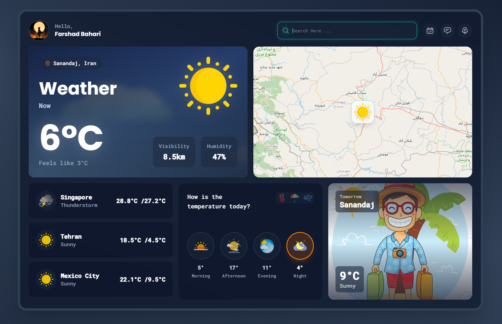
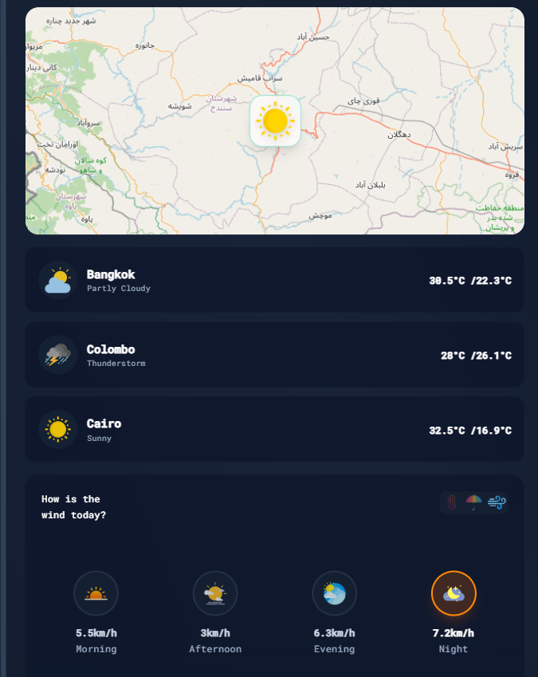

# 🌦️ Weather App - Modern React Weather Application

<div align="center">

   

**[Live Demo](https://fer-feri.github.io/weather-app/)** | **[Report Bug](https://github.com/fer-feri/weather-app/issues)** | **[Request Feature](https://github.com/fer-feri/weather-app/issues)**

A modern, responsive weather application providing real-time weather information for any location worldwide.

<!-- اسکرین‌شات‌ها -->
<p align="center">
  
</p>

<p align="center">
  
</p>
</div>

---

## 🌟 Overview

Weather App is a sleek and intuitive weather forecasting application built with React that delivers accurate weather data with a beautiful user interface. Get current conditions, hourly forecasts, and 7-day predictions at your fingertips.

### ✨ Key Highlights

- 🎨 **Beautiful UI** - Dynamic backgrounds that change based on weather conditions
- 🌍 **Interactive Map** - Click anywhere on the map to get weather for that location
- 📊 **Detailed Metrics** - Temperature, humidity, wind speed, UV index, and more
- 🕐 **Smart Forecasting** - Hourly and 7-day weather predictions
- 🌡️ **Flexible Units** - Switch between Celsius and Fahrenheit
- 🔍 **Smart Search** - City search with autocomplete functionality
- 📱 **Fully Responsive** - Optimized for all devices and screen sizes
- 🌙 **Dark Theme** - Eye-friendly dark interface

---

## 🚀 Features

### 📡 Real-time Weather Data

- Current temperature with "feels like" metric
- Weather conditions with intuitive icons
- Humidity, wind speed, and direction
- UV index and air quality
- Sunrise and sunset times

### 📈 Advanced Forecasting

- Hourly forecast for the next 24 hours
- 7-day detailed weather outlook
- Period-based forecasts (Morning, Afternoon, Evening, Night)
- Rain probability and precipitation amounts
- Wind speed predictions

### 🗺️ Interactive Map

- Powered by Leaflet.js for smooth interactions
- Click-to-select any location worldwide
- Custom weather-based map markers
- Smooth zoom and pan animations

### 🔎 Smart Features

- City search with autocomplete
- Geolocation support (find me button)
- Automatic city detection
- Error handling with helpful messages
- Loading states for better UX

### 🎯 User Experience

- Responsive design for mobile, tablet, and desktop
- Fast loading with optimized performance
- Accessibility considerations

---

## 🛠️ Tech Stack

### Frontend

- **React 18** - Modern UI library with hooks
- **Vite** - Lightning-fast build tool
- **Tailwind CSS 4** - Utility-first CSS framework
- **Framer Motion** - Smooth animations

### APIs & Libraries

- **Open-Meteo API** - Free weather data provider (no API key needed)
- **Leaflet.js** - Interactive mapping library
- **React Leaflet** - React components for Leaflet
- **Axios** - Promise-based HTTP client
- **date-fns-jalali** - Persian calendar support

### Development Tools

- **ESLint** - Code quality and consistency
- **vite-plugin-svgr** - Import SVGs as React components
- **gh-pages** - Automated GitHub Pages deployment

---

## 📦 Installation

### Prerequisites

- Node.js (v18 or higher)
- npm or yarn package manager

### Setup Instructions

1. **Clone the repository**

```bash
git clone https://github.com/fer-feri/weather-app.git
cd weather-app

2. **Install dependencies**
bash
npm install

3. **Start development server**
bash
npm run dev
Open http://localhost:5173 in your browser

4. **Build for production**
bash
npm run build

5. **Preview production build**
bash
npm run preview

6. **Deploy to GitHub Pages**
bash
npm run deploy

---

## 💻 Usage

### Basic Usage

1. **Search for a city**: Type any city name in the search bar
2. **Use geolocation**: Click the location icon to detect your current position
3. **Map selection**: Click anywhere on the map to get weather for that location
4. **View forecasts**: Scroll down to see hourly and weekly predictions
5. **Toggle units**: Click the temperature to switch between °C and °F

### Configuration

You can customize the app by creating a `.env` file in the root directory:

env
VITE_APP_TITLE=My Weather App
VITE_DEFAULT_CITY=Tehran
VITE_DEFAULT_LAT=35.6892
VITE_DEFAULT_LON=51.3890

---

## 📁 Project Structure


weather-app/
├── public/
│   ├── backgrounds/           # Weather condition backgrounds
│   │   ├── clear.jpg
│   │   ├── cloudy.jpg
│   │   ├── rainy.jpg
│   │   └── ...
│   ├── map-icon/              # Map marker icons
│   │   ├── 0.png
│   │   ├── 1.png
│   │   └── ...
│   └── weather-icons/         # Condition icons
│       ├── clear-day.svg
│       ├── rain.svg
│       └── ...
├── src/
│   ├── components/
│   │   ├── CurrentWeatherCard.jsx    # Main weather display
│   │   ├── TomorrowCard.jsx          # Tomorrow's forecast
│   │   ├── DayPeriodsCard.jsx        # Morning/Afternoon/Evening
│   │   ├── HourlyForecast.jsx        # 24-hour forecast
│   │   ├── WeeklyForecast.jsx        # 7-day outlook
│   │   ├── MapWeather.jsx            # Interactive map
│   │   └── SearchBar.jsx             # City search
│   ├── services/
│   │   └── weatherApi.js             # API calls and data fetching
│   ├── utils/
│   │   ├── temperatureHelpers.js     # Temperature calculations
│   │   ├── weatherHelpers.js         # Weather code mappings
│   │   └── dateHelpers.js            # Date formatting
│   ├── App.jsx                       # Main app component
│   ├── main.jsx                      # Entry point
│   └── index.css                     # Global styles
├── package.json
├── vite.config.js                    # Vite configuration
├── tailwind.config.js                # Tailwind configuration
├── README.md
└── .gitignore

---

## 🌐 API Reference

This project uses the **[Open-Meteo API](https://open-meteo.com/)** - a free weather API with no authentication required.

### Main Endpoint

javascript
GET https://api.open-meteo.com/v1/forecast

Parameters:
- latitude: number (required)
- longitude: number (required)
- current_weather: boolean
- hourly: string[] (temperature_2m, rain, windspeed_10m, etc.)
- daily: string[] (temperature_2m_max, temperature_2m_min, weathercode, etc.)
- timezone: string (e.g., "Asia/Tehran")

### Example Request

javascript
const response = await axios.get('https://api.open-meteo.com/v1/forecast', {
  params: {
latitude: 35.6892,
longitude: 51.3890,
current_weather: true,
hourly: ['temperature_2m', 'rain', 'windspeed_10m'],
daily: ['temperature_2m_max', 'temperature_2m_min', 'weathercode'],
timezone: 'Asia/Tehran'
  }
});

### Weather Codes

| Code | Condition |
|------|-----------|
| 0 | Clear sky |
| 1-3 | Partly cloudy |
| 45, 48 | Fog |
| 51-67 | Rain |
| 71-77 | Snow |
| 80-99 | Thunderstorm |

Full documentation: [Open-Meteo Docs](https://open-meteo.com/en/docs)

---

## 🤝 Contributing

Contributions make the open-source community an amazing place to learn and create. Any contributions are **greatly appreciated**!

### How to Contribute

1. Fork the Project
2. Create your Feature Branch
bash
git checkout -b feature/AmazingFeature

3. Commit your Changes
bash
git commit -m 'Add some AmazingFeature'

4. Push to the Branch
bash
git push origin feature/AmazingFeature

5. Open a Pull Request

### Development Guidelines

- Follow existing code style and conventions
- Write clear, descriptive commit messages
- Add comments for complex logic
- Test thoroughly before submitting
- Update documentation if needed

---

## 📝 License

Distributed under the MIT License. See `LICENSE` file for more information.

---

## 👤 Author

**Fershad (Fer-Feri)**

- GitHub: [@Fer-Feri](https://github.com/Fer-Feri)
- Project: [weather-app](https://github.com/Fer-Feri/weather-app)
- Live Demo: [https://fer-feri.github.io/weather-app/](https://fer-feri.github.io/weather-app/)


---

## 🙏 Acknowledgments

- [Open-Meteo](https://open-meteo.com/) - Free weather API
- [Leaflet](https://leafletjs.com/) - Interactive maps library
- [Tailwind CSS](https://tailwindcss.com/) - CSS framework
- [Vite](https://vitejs.dev/) - Build tool
- Weather icons from various free sources


---

## 📈 Future Enhancements

- [ ] User preferences and favorite locations
- [ ] Weather alerts and notifications
- [ ] Air quality index display
- [ ] Multi-language support
- [ ] Weather radar and satellite imagery
- [ ] Historical weather data
- [ ] PWA support for offline usage
- [ ] Weather comparison between cities

---

## 🎓 What I Learned

This project helped me learn:

- ✅ Working with real-world APIs and handling async operations
- ✅ Building interactive maps with Leaflet
- ✅ Complex state management in React
- ✅ Responsive UI design with Tailwind CSS
- ✅ Deploying to GitHub Pages with Vite
- ✅ Performance optimization techniques
- ✅ Working with both Gregorian and Persian calendars
- ✅ Error handling and loading states
- ✅ Clean code architecture and component organization

---

  🎉Made with ❤️ by Farshad


```
